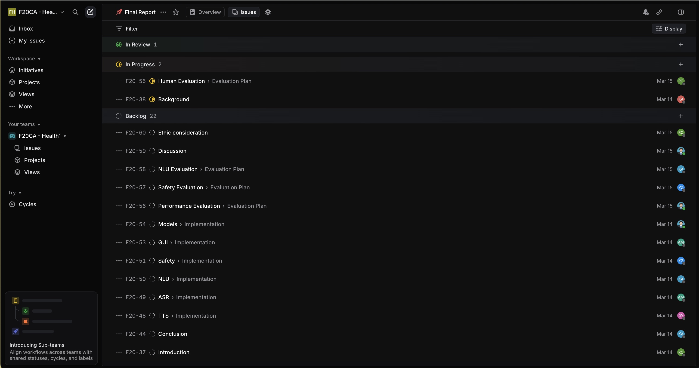

# Minutes

Note: Allocation for Report Writing; Integration GitHub Rep; Demo 

Present: am2102, rv2009, zj2009, lh2020, zy2017,jk2023

Minutes taken by: zj2009

## Agenda

- Allocation for report writing
- Integration package uppload to Github rep with same format
- Demo 

# Topics

## Allocation

## Overleaf 

https://www.overleaf.com/project/67c70b0844af9e93f07aa5f1 

parts of report have been finished

By the end of week 11, first draft for report have to be finished

### Linear issue about report

https://linear.app/f20ca-health1/project/final-report-4c841aed91b7 

## Integration

Integration rep: https://github.com/F20CA-Health1/Healthcare-Assistant

## Demo

Details about demo: next week to discuss (how to organize the structure of demo/contents of demo)

# Questions for Meeting

- Personal report(contents;template)
- Final submission time
  
Canvas demo assessment： content is important
