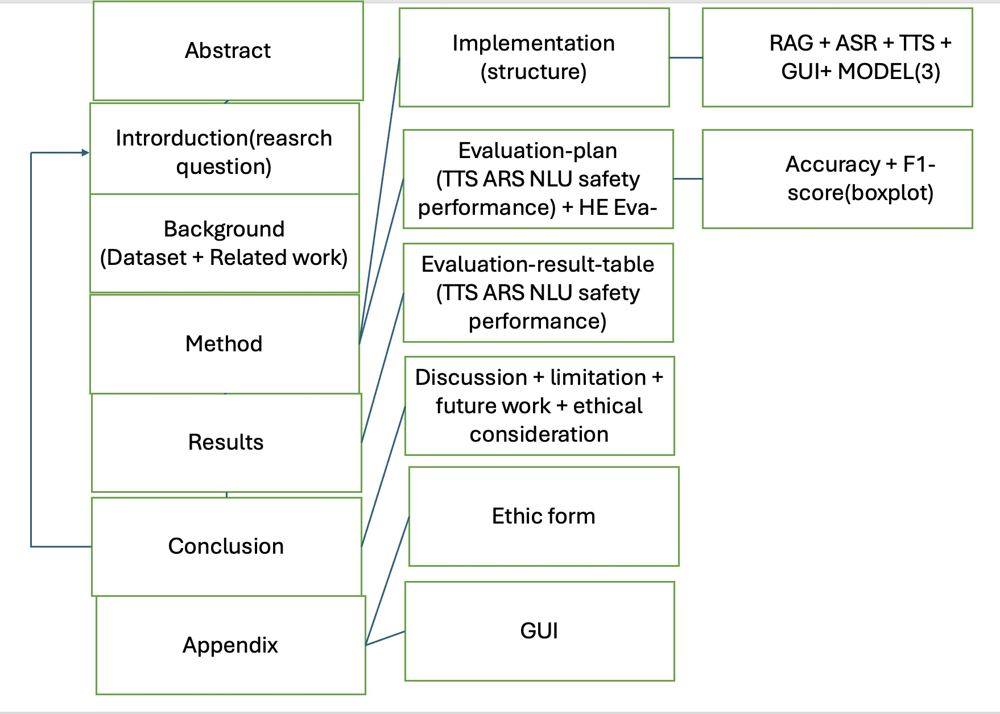

# Minutes

Note: Integration for Health System; ACL Report

Present: am2102, rv2009, zj2009, lh2020, zy2017,jk2023

Minutes taken by: zj2009

## Agenda

- Discuss integration for Health System
- deciede the report's structure

# Topics

## Integration Method

It should be converted into python package for each module,

Integration rep: https://github.com/F20CA-Health1/Healthcare-Assistant

## Framework for Final Report

## Overleaf Workshop for Vscode

link: https://github.com/iamhyc/Overleaf-Workshop

## Local Model Choices:

- Llama3: 8b
- Deepseek: 7b
- MED42-V2

# Questions for Meeting

- whether the source codes should be submitted
- demo first, report second
- time allocation between dissertation (3.27) and F20CA project
